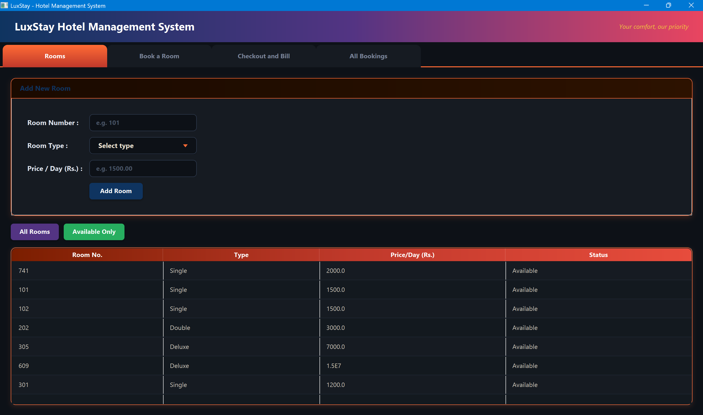
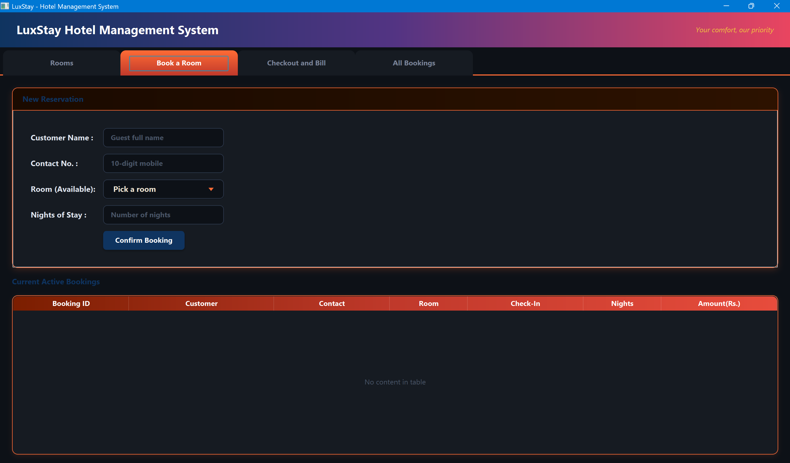
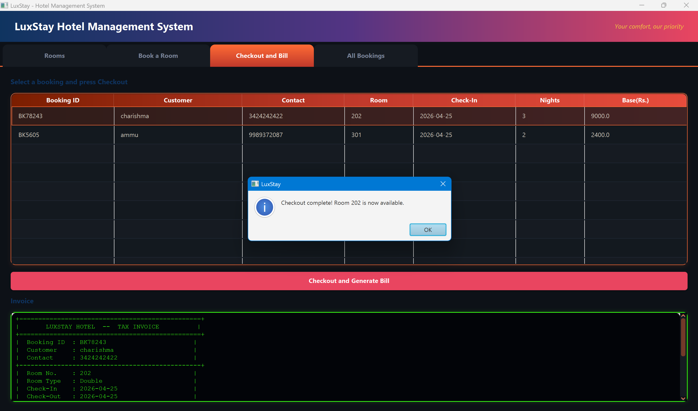
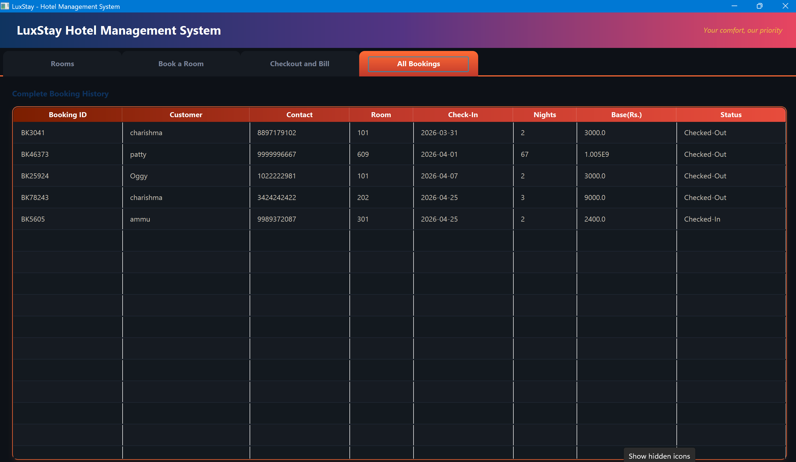

# LuxStay — Hotel Management System

A desktop Hotel Management System built with **Java 21** and **JavaFX**, featuring room management, guest bookings, check-out processing, and GST-inclusive invoice generation.

---

## Overview

LuxStay provides a clean GUI for hotel staff to manage rooms and bookings end-to-end — from adding room inventory to generating a formatted tax invoice on check-out.






---

## Features

- **Room Management** — Add rooms with type (Single / Double / Deluxe) and price per night; view all rooms or filter by availability
- **Booking** — Select an available room, enter guest details, and confirm a booking with a GST (12%) breakdown
- **Check-out** — Select an active booking, release the room back to available, and generate a formatted tax invoice
- **Booking History** — View all past and current bookings in a dedicated history table
- **Data Persistence** — Rooms and bookings are saved to `.dat` files using Java serialization, so data survives application restarts
- **Input Validation** — Contact number must be 10 digits, price must be positive, duplicate room numbers are rejected

---

## Tech Stack

| Layer | Technology |
|-------|-----------|
| Language | Java 21 |
| UI Framework | JavaFX 21.0.2 |
| UI Layout | FXML + CSS |
| Build Tool | Maven |
| Data Storage | Java Serialization (`.dat` files) |

---

## Project Structure

```
HotelMS/
├── src/main/java/hotel/
│   ├── Main.java             # JavaFX entry point, loads FXML and sets window
│   ├── MainController.java   # All UI logic: add room, book, check-out, billing
│   ├── Room.java             # Room data model (Serializable)
│   ├── Booking.java          # Booking data model (Serializable)
│   └── DataManager.java      # File I/O — loads and saves rooms & bookings
├── src/main/resources/hotel/
│   ├── main.fxml             # UI layout (Scene Builder compatible)
│   └── style.css             # Custom styles for the application
├── rooms.dat                 # Persisted room data (auto-generated)
├── bookings.dat              # Persisted booking data (auto-generated)
└── pom.xml                   # Maven build config
```

---

## Getting Started

### Prerequisites

- Java 21 or higher
- Maven 3.6+

### Run the Application

```bash
# Clone the repository
git clone https://github.com/Charishma1310/hotel-management-system.git
cd hotel-management-system

# Run using Maven
mvn javafx:run
```

### Build a Standalone JAR

```bash
mvn package
java -jar target/hotel-management-1.0.0.jar
```

---

## How to Use

1. **Add a Room** — Enter a room number, select a type, set a price per night, and click *Add Room*
2. **Make a Booking** — Enter guest name, 10-digit contact, select an available room, enter number of nights, and click *Book*
3. **Check Out** — Go to the *Active Bookings* tab, select a booking, and click *Check Out* — a receipt is generated automatically
4. **View History** — The *History* tab shows all bookings with their current status (Checked-In / Checked-Out)

---

## Sample Invoice

```
+================================================+
|       LUXSTAY HOTEL  --  TAX INVOICE          |
+================================================+
|  Booking ID  : BK83421                        |
|  Customer    : John Doe                       |
|  Contact     : 9876543210                     |
+------------------------------------------------+
|  Room No.    : 101                            |
|  Room Type   : Deluxe                         |
|  Check-In    : 2026-04-07                     |
|  Check-Out   : 2026-04-10                     |
|  Nights      : 3 night(s)                    |
+------------------------------------------------+
|  Rate/Night  : Rs. 3500.00                    |
|  Room Charges: Rs. 10500.00                   |
|  GST  (12%) : Rs. 1260.00                    |
+------------------------------------------------+
|  TOTAL AMOUNT: Rs. 11760.00                   |
+------------------------------------------------+
|    Thank you for staying at LuxStay!          |
+================================================+
```

---

## Possible Future Improvements

- Replace file serialization with a SQLite or MySQL database
- Add a login/authentication screen for staff
- Support room search by number or type
- Export invoices as PDF

---

## Author

Charishma Sree Kandipilli  
[GitHub](https://github.com/Charishma1310) • [LinkedIn](https://www.linkedin.com/in/charishma-sree-kandipilli-861009318/)

